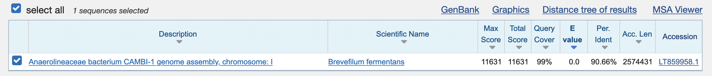

# Assembler practical answers

## Genome Assembly with Minimap2 and Miniasm

### 1. How many unitigs are there and what is the length of the longest one?

The fasta file contains 10 unitigs (n = 10) and the longest unitig is 1,588,013 nucleotides long.

### 2. Do you think we found a good match using BLAST?

The Blast result page shows that the database sequence is

* hits 99% of our sequence (query cover)
* with 90.66% identical nucleotides
* and an E-value of 0

That makes it a really good hit.

### 3. How closely do you think is the hit organism related to our critter?

>90% identity should already indicate a very close relationship. Additionally, as this is an unpolished unitig sequence, some of the differences could be attributed to sequencing errors. Hence the actual percent-identity is most likely higher. THerefore, we could hypothesis that this is the same genus , possibly the same species of baceria.

### 4. How many of the miniasm sequences align with the reference?

6 out of 10

### 5. How many nucleotides align to the reference? What is the average percent identity of the aligned sequences

The output shows that >97% of the B. fermentans sequence and >92% of the miniasm assembly align. Furthermore, depending on whether we look at  the <i>1-to-1</i> or the <i>M-to-M</i> statistics, the %-identity is either 94.11 or 94.06, respectively.

  
  The difference between is that the <i>1-to-1</i> relationship only counts those alignment blocks that are bidirectional, i.e., hits reference->query as well as query->reference. In contrast, the <i>M-to-M</i> option (many-to-many) also counts alignment blocks that are only found in a reference->query or query->reference direction. Thus the M-to-M option is a <i>superset</i> of the 1-to-1 option that maximises the coverage of all alignments at the expense of %-indentity.

----

## Genome assembly using Flye

### 1. Does the assembly differ from the miniasm assembly, e.g., wrt total length, number of contigs and length of the contigs?

Yes, the Flye assembly results in ~3 times the number of contigs (31). Additionally, the longest sequence is very similar to the length of the B. fermentans genome. It also represents >=80% of the complete assembly (see N50-N80 values and number of sequences). Hence, the additional 30 sequences represent <=20% of the complete assembly, i.e., are pretty short.
Furthermore, the Flye assembly is ~300,000 nucelotides longer in total.

### 2. How many contigs aligned with the reference? What is the error rate?

Of the 33 contigs in the Flye assembly 31 aligned to the reference. Interestingly, as can be seen in the <i>Bases</i> statistics only ~30% of all the bases in the Flye assembly aligned to the reference. Thus, the two unaligned contigs seem to be contain ~70% of the bases.

As expected the error rate of the Flye assembly is much lower than the miniasm assembly because Flye also includes a consensus sequence step which decreases the 1-to-1 error rate to <1% and the M-to-M error rate to <2%.

### 3. How many contigs align well with the reference?

Although the report shows 33 contigs that align to a certain degree with the reference the assemblytics dot-plot shows that only one contig alignes significantly with the reference: contig_2.

### 4. Is the Flye assembly more or less fragmented than the miniasm assembly? Why?

The Flye assembly is less fragmented (one contig aligns to the whole reference vs 2 in the miniasm assembly). There are several possible explanations. The most likely one is the fact that miniasm outputs unitigs where Flye outputs contigs. Remember, unitigs are <i>high confidence</i>contigs, i.e., the path in the assembly graph shows no conflicts or ambiguous paths. In contrast, Flye includes several heuristics that resolve conflicts and ambiguities in the assembly graph to output more contiguous sequences (contigs). Another explanation is that Flye's <i>repeat graph</i> approach may be able to resolve repeat regions much better than miniasm.

### 5. Does the alignment differ from the reference, e.g., does the Flye assembly extend the start or stop of the reference? Are there inversions?

If you zoom in on contig_2 (click ont he name) it seems that contig_2 extends the reference (slightly) at the start (the diagonal line starts at >0 on the Y-axis).

----

## Miniasm Medaka Error Correction

### 1. Did the quality of the assembly change

Yes, now 7/10 not 6/10 sequences align to the reference. Furthermore, the length of the miniasm assembly has increase, as well as the number of aligned nucleotides (92.85% to 93.48%) and average %-identity has increased from ~94% to >99%.

<a href="https://bluemountainsanalytics.github.io/bma_ont_biosec_2022/ASS_ERR.html">BACK =></a>

## Flye Medaka Error Correction

### 1. How did the quality of the assembly change

In contrast to the miniasm assemlbye Medaka has improved the flye assembly only marginally,e.g., the *1-to-1* alignment %-identity increased from 99.84 to 99.86%. Given that Flye apready performs error correction this is somewhat expected. However, this is not always the case. Especially for R9.4 chemistries or different genomes Medaka can have a more significant effect on the assembly quality.

<a href="https://bluemountainsanalytics.github.io/bma_ont_biosec_2022/ASS_ERR.html">BACK =></a>

