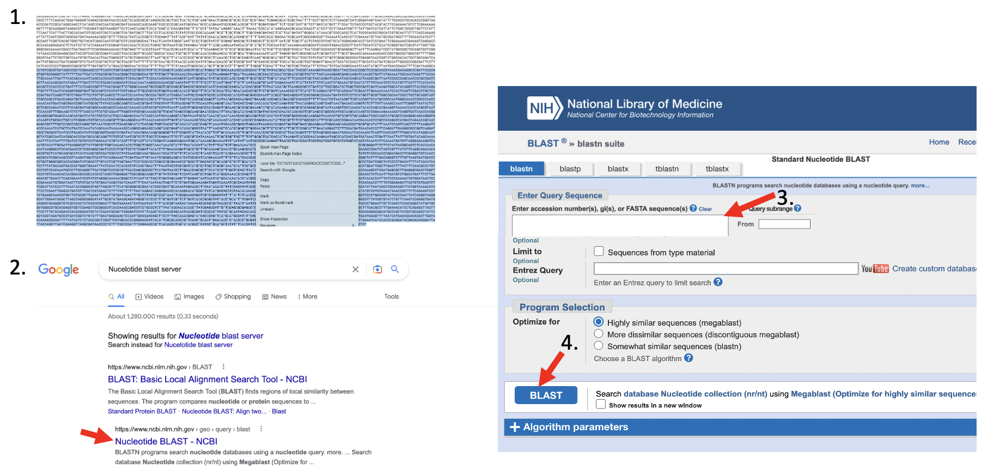

# Genome Assembly with Minimap2 and Miniasm 

[](ASS.md) [](index.md) [](ASS_F.md)

The minimap2-miniasm pipeline is an incredibly fast and memory efficient way of assembling Long-Read data. However, it has several characteristics that differ from other assemblers:

 1. Miniasm outputs *unitigs* not *contigs*. Unitigs are *unique* parts in the assembly graph. This means all reads in your data "agree" on this part of the assembly. One could say they are high-confidence contigs. In contrast, *contigs* may include regions with ambiguous read information, depending on the algorithm used. As a result unitigs can be shorter and the miniasm assemblies more fragmented
 2. Miniasm does not build a *consensus sequence* of the assembly. Building a consensus sequence is a common practice to reduce errors that the sequencing process introduces into single sequencing reads. By building a censensus sequence where each nucleotide position is based on the consensus of many reads covering the position sequencing errors can be removed and the resulting assembly is of much higher quality. 
 
First use minimap to map the filtered nanopore reads onto themselves. This will identify overlaps between the read. 

Change into the directory *assembler_practical/minimap-miniasm* in the practical directory and map the reads using


    course_user> minimap2 –x ava-ont -t 4\
    course_user> ../../qc_practical/filtered.fastq \ 
    course_user> ../../qc_practical/filtered.fastq \
    course_user>> ./minimap.paf

<br>
<div style="background-color:#fcfce5;border-radius:5px;border-style:solid;border-color:gray;padding:5px">
   
  The “\” at the end of each line is only for convenience to write a long command into several lines. It tells the command-line that all lines still belong together although they are separated by “enter” keys. However, you can type all of the commands in one line jsut without the backslach *\*
</div>
<br>
The above command will compare all filtered reads in the fastq file against each other. The output will be printed to the command-line and redirect (>) into a file called minimap.paf. This file contains all the matching regions of a read with all other reads. 

The mapping step is computationally expensive. Minimap can therfore distribute the load to many *processor cores*. The command above is using 4 processor cores indicated byt he *-t* flag. In bigger computers this number can be further inceased to speed up the mapping process. If your machine takes too long you can also stop minimap by pressing *Ctrl-c* and copy the pre-compiled results into this folder using 

    course_user> cp ~/biosec_course/misc/assembler_tutorial/minimap.paf .

Now use the read overlap information from minimap and the sequences from the filtered fastq file to assemble unitigs using the tool *miniasm*

    course_user> miniasm -f \
    course_user> ../../qc_practical/filtered.fastq \
    course_user> ./minimap.paf > miniasm.gfa

Miniamp and miniasm do not provide an option for output files but instead write the output directly to the terminal, hence the redirection (>).

The output of miniasm is a column based file in *Graphical Fragment Assembly* (gfa) format. It contains the name of a unitig in column 2 and the sequence in column 3. To extract those two columns and write them into a fasta file of unitigs use the following *awk* command

```
awk ’/^S/{print “>”$2”\n”$3}’ miniasm.gfa > miniasm.fasta
```

This will create a fasta file with all assembled unitigs called miniasm.fasta. 

<div style="background-color:#fcfce5;border-radius:5px;border-style:solid;border-color:gray;padding:5px">
  
  A *fasta* file is the predecessor of the fastq file format. In contrast to the fastq file it only stores the name of a sequence in one line starting with a bigger-than sign (>) and the sequence in the lines after the header line. Fasta was the most common sequence file format prior to the fastq format. 
</div>

But what does the assembly look like? 

### Check the assembly using *assembly-stats* 

To get some basic assembly statistics use the tool *assembly-stats*.

    course_user> assembly-stats ./miniasm.fasta


Assembly-stats reports basic statistics about all sequences in a fasta file, e.g. N50, longest sequence, total number of nucleotides etc. 

<div style="background-color:#cfedfe;border-radius:5px;border-style:solid;border-color:gray;padding:5px">
   
  <ol>
   <li>How many unitigs are there and what is the length of the longest one?</li>
 </ol>
</div>
[Answer](ASS_ANS.md#genome-assembly-with-minimap2-and-miniasm)

### Identify your critter

The quality of assemblies can be assessed using many different metrics such as the percentage of reads that map to the assembly, N50, L50 and others. Another way is to compare it to a closely related strain or isolate. But how do we find a closely related organisms? We don't even know what we just assembled? 

A quick and easy way is to compare it to known sequences, e.g. using the popular *Basic Local Alignment Search Tool* (BLAST).

First, print the miniasm.fasta sequences to the command-line using the *head* command

    course_user> head miniasm.fasta

To compare the sequence:

 * highlight a larger stretch of the sequence with your mouse, right-click and copy the sequence.
 * open firefox, and google "NCBI nucleotide blast server" 
 * open the link to the *Nucleotide Blast* server of the National Center for Biotechnology Information (NCBI)
 * paste your sequence into the *Enter Query Sequence*n tex field, scroll down and press *BLAST*




After a while you will get the results of the search. The important metrics to assess whether your sequence matches another sequence will are

 * Query cover: How much of your sequence actually matches the known NCBI database sequence?
 * Percent Identity: What is the percentage of identical nucleotides over the query cover?
 * E-value: This is a measure for the likelyhood that the similarity between the two sequences, the query and the database sequence, could have been by chance. The lower the E-value the less likely that the similarity is a chance encounter.

<div style="background-color:#cfedfe;border-radius:5px;border-style:solid;border-color:gray;padding:5px">
  
  <ol start="2">
   <li>Do you think we found a good match using BLAST?</li>
   <li>How closely do you think is the hit organism related to our critter?</li>
 </ol>
</div>
[Answer](ASS_ANS.md#blast-results)


### Compare the complete assembly to a reference

Now that we found a close relative, lets compare the complete assembly to it's genome. In directory *~/course_data/misc* you will find the sequence of the bacteria we just identified, *Brevefilum fermentans* in the fasta file *b_fermentans.fna* 

First get some assembly statistics. Use assembly-stats to get an overview over the B. fermentans genome , e.g., number of nucleotides, total length, and number of Ns (gaps or ambiguous sequences). 

Compare the two statistics. Do some of the miniasm unitigs match the reference sequence in length?

### Compare two assemblies using *Mummer/DNADiff* 

To compare the miniasm assembly to the reference genome use the tool dnadiff that is part of the Mummer package. Mummer is a fast aligner that can align complete genomes in relatively short time.

    course_user> dnadiff -p dnadiff ~/biosec_course/misc/assembly_practical/b_fermentans.fna miniasm.fasta

The above command will align the B. fermentans sequence with the miniasm unitigs in the fasta file and produce a series of output files that all start with the prefix *dnadiff*. Open the file *dnadiff.report* (e.g. by navigating to the folder and double-clicking it) to see a report of the analysis. 

<div style="background-color:#cfedfe;border-radius:5px;border-style:solid;border-color:gray;padding:5px">
   
  <ol start="4"> 
   <li>How many of the miniasm sequences align with the reference?</li>
   <li>How many nucleotides align to the reference? What is the average percent identity of the aligned sequences></li>
 </ol>
</div>
[Answers](ASS_ANS.md#2-how-many-of-the-miniasm-sequences-align-with-the-reference)


Given that this is a *raw* assembly, i.e., no error correction, polishing or the like has been performed, a sequence similarity of >=94% would already be pretty good if we compared it to the actual reference. Given that the NCBI sequence is most likely only closely related and not identical, the quality of the miniasm assembly is very good.


<p align="right"><a href="https://bluemountainsanalytics.github.io/bma_ont_biosec_2022/ASS_F.html">CONTINUE -></a>
</p>


