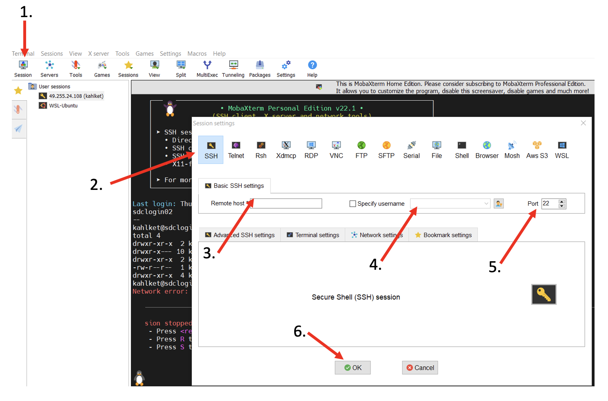

# Command-line Tools

[](INTRO_4.md) [](index.md) [](CONDA_1.md)

For this tutorial you will need a CLI of some sort. All operating systems and computers come with some sort of  CLI installed. On Linux and MACOS/OSX computers it's called *Terminal*, and Powershell on Windows systems. However, from a programming and bioinformatics point of view some are more useful than others.

# Linux & OSX/Apple users

The Terminal that comes pre-installed on all linux-based systems, including OSX/MacOS, such as Ubuntu is ready to use for remote access to another computer using the command **ssh**. 

Terminal on OSX/MacOS: the terminal can be found under *Applications->Utilities->Terminal*

Terminal on Ubuntu: On Ubuntu the terminal app can be found in your Software Center.

Once you open your Terminal you can check if **ssh** is installed with the **which** command:

    john> which ssh
    /usr/bin/ssh

If ssh is installed on your system the command will print the absolute path to the tool as above. If not, please use your package manager of choice to install it. For example. on Ubuntu computers please use

    john> apt-get install ssh

On OSX/MacOS you may need to install XCode from your App-Store.

## How to connect to a remote computer using ssh

To connect to a remote computer using ssh you will need

  <ol>
    <li>a <b>user name and password</b> for that computer</li>
    <li>the <b>IP address</b> of that computer</li>
    <li>if applicable, the non-default <b>ssh port</b></li>
  </ol>

For example, if your user name was **user1** and the IP address of the remote linux computer was **111.222.333.444** then you would connect to is as follows

    john>ssh user1@111.222.333.444

  
  <b>Non-default ssh port</b> 
  Usually, the ssh command does not require you to specify the <i>port</i> to use because the default port (22) is automatically added to the ssh command if it's not changed. However, in some cases a non-default port has to be specified for security reasons. In that case you will be provided with the specific port with your login details. The port will have to be added with the <b>-p</b> flag, e.g. <b>ssh -p 12345 user1@111.222.333.444</b>

If you connect to remote computer for the first time you will be asked to add the remote ssh-key to your system (type *yes* and press Enter).

Type in your password once you are asked for it. **You won't see any character when typing your password!**. This does not mean that something is wrong. This is a security mechanism, i.e., you will have to type your password "blind".

Once you pressed *Enter* (and given the password/port are correct) your terminal will now be connected to the remote machine and you are ready to go.

# Windows Users

The Powershell that comes installed on Windows operating systems differs significantly from the Terminal apps provided by the other systems and lacks the common development tools including **ssh**. Additionally, Windows has a different path notation: paths on Windows use the backslash **\** instead of the slash of linux-based systems. Thus, even if the commands on linux and Windows CLI were the same the difference in the path notation would make them incompatible.

Given that most servers, workstations and bioinformatics workflows use linux-based operating systems, Windows users need a CLI that is linux based, e.g., to connect to a linux-based computer somewhere on the web.

Many different options and tools exist, e.g., the Windows-Linux-Subsystem (WLS) that can be installed on newer Windows machines. However, below we will introduce one of the most common tools used, *MobaXTerm*, to connect remotely to linux-based workstations.

  
  <b>Root access and MobaXTerm</b> 
  MobaXTerm does not have to be installed but can be used right away. This means no root or admin rights/privileges are required to install it. However, some Windows laptop's Firewalls are configured to block the ports that are used by MobaXTerm. In that case, root/admin rights are required to change the firewall. 
  If you encounter a <b>Windows Firewall</b> warning when trying to connect with MobaXTerm you can also use a Terminal in your browser as will be explained later in the tutorial.

## How to install MobaXTerm

To install MobaXterm please go to the download page [here](https://mobaxterm.mobatek.net/download-home-edition.html) and choose the **Home Edition (Portable Edition)**.

After the download is finished please extract the downloaded zip file, e.g., by double-clicking it and copy the file **MobaXTerm_Personal_22.1.exe** to your Desktop.

## How to connect to a remote server using MobaXTerm

As with linux-based systems to connect to a remote computer using ssh you will need

  <ol>
    <li>a <b>user name and password</b> for that computer</li>
    <li>the <b>IP address</b> of that computer</li>
    <li>if applicable, the non-default <b>ssh port</b></li>
  </ol>

These will be provided to you during the course.

To connect to a remote computer

  <ol>
    <li>Douber-click the <i>MobaXTerm_Personal_22.1.exe</i> you just compied to your Desktop</li>
    <li>On the MobaXTerm GUI click <b>Session</b> in the upper-left corner</li>
    <li>Click <b>SSH</b> on the next screen</li>
    <li>Fill in the IP address in the <b>Remote host</b> field</li>
    <li>Fill in your user name in the  <b>Speficic username</b> field</li>
    <li>And, in case you are given a ssh port other than 22, set the <b>Port</b> to that number</li>
    <li>Press <b>OK</b></li>
  </ol>

MobaXTerm will then ask you for your password, which you should type in. It might also ask you if you want to store the password in a password manager (press *Cancel*). **Note that you may not see any characters when typing your password!**. This does not mean that something is wrong. This is a security mechanism, i.e., you will have to type your password "blind".

Once you're connected MobaXTerm will open a terminal window and you can type commands on the remote computer.

  
  <b>Root access and MobaXTerm</b> 
  On some Windows laptops the Firewall is configured to block the ports that are used by MobaXTerm. In that case, root/admin rights are required to change the firewall. 
  If you encounter a <b>Windows Firewall</b> warning when trying to connect with MobaXTerm you can also use a Terminal in your browser as will be explained later in the tutorial.

<a href="https://bluemountainsanalytics.github.io/BMA_CLI-tutorial/CONDA_1.html">CONTINUE -></a>

