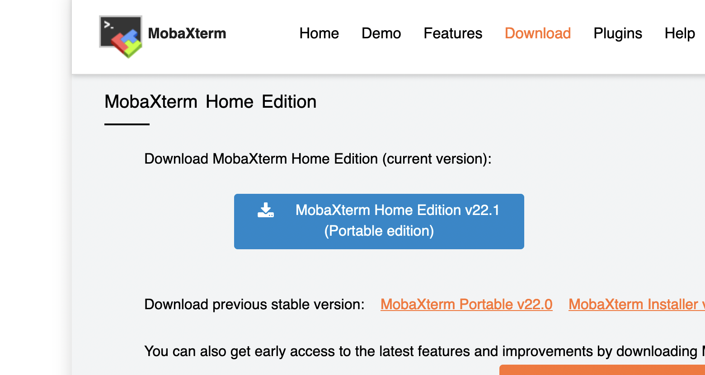

# Command-line Tools

[](INTRO_4.md) [](index.md) [](CONDA_1.md)

For this tutorial you will need a CLI of some sort. All operating systems and computers come with some sort of  CLI installed. On Linux and MACOS/OSX computers it's called *Terminal*, and Powershell on Windows systems. However, from a programming and bioinformatics point of view some are more useful than others.

# Linux users

The Terminal that comes pre-installed on linux-based systems such as Ubuntu is ready to use and comes with many development and command-line tools installed. To open your terminal go to your Software Center, search for **Terminal** and click it. Done. The only thing to check is if you have the tool **ssh* installed. 

Use the command **which** to check if you got ssh installed:

    john> which ssh
    /usr/bin/ssh

If ssh is installed on your system the command will print the absolute path to the tool as above. If not, please use your package manager of choice to install it. For example. on Ubuntu computers please use

    john> apt-get install ssh

## How to connect remotely to linux computer using ssh

To connect to a remote computer using ssh you will need

  <ul>
    <il>a user name and password for that computer</il>
    <il>the IP address of that computer</il>
  </ul>

For example, if you user name was **user1** and the IP address of the remote linux computer was **111.222.333.444** then you would connect to is as follows

    john>ssh user1@111.222.333.444

If you connect to the computer for the first time it will ask you to add its key (type *yes* and press Enter).

It will then ask you for your password which you should type in then. Be aware that you will not see characters of any kind when you type in your password. This does not mean that something is wrong. This is a security mechanism, i.e., you will have to type your password "blind".

Once you pressed *Enter* (and given the password was correct) you will be connected to the remote machine.

# MACOS / OSX users

Apple computers with OSX and MACOS installed also come with a Terminal app. Historically, Apple operating systems are also linux-based. However, newer versions lack many development tools and require installation via XCode. 

# Windows Users

The Powershell that comes installed on Windows oeprating systems differs significantly from the Terminal apps provided by the other systems and lacks the common development tools found on linux systems. Additionally, Windows has a different path notation: paths on Windows use the backslash **\** instead of the slash of linux-based systems. Thus, even if the commands on linux and Windows CLI were the same the difference in the path notation would make them incompatible.

Given that most servers, workmachines and bioinformatics workflows use linux-based operating systems, Windows users need a CLI that is linux based, e.g., to connect to a linux-based computer somewhere on the web.

Many different options and tools exist, e.g., the Windows-Linux-Subsystem (WLS) that can be installed on newer Windows machines. However, below we will introduce one of the most common tools used, *MobaXTerm*, to connect to connect remotely to linux-based workstations.

  
  <b>Root access and MobaXTerm</b> 
  MobaXTerm does not have to be installed but can be used right away. This means no root or admin rights/privileges are required to install it. However, some Windows laptop's Firewall are configured to block the ports that are used by MobaXTerm. In that case, root/admin rights are required to change the firewall. 
  If you encounter a <b>Windows Firewall</b> warning when trying to connect with MobaXTerm you can also use a Terminal in your browser as will be explained later in the tutorial.

## How to install MobaXTerm

To install MobaXterm please go to the download page [here](https://mobaxterm.mobatek.net/download-home-edition.html) and choose the **Home Edition (Portable Edition)**.

After the download is finished please extract the downloaded zip file, e.g., by double-clicking it and copy the file **MobaXTerm_Personal_22.1.exe** to your Desktop.

## How to connect to a remote server

For the tutorial you will connect to an AWS instance, i.e., a remote linux computer that we hired for this course.

To connect to that computer first double-click 

<a href="https://bluemountainsanalytics.github.io/BMA_CLI-tutorial/CONDA_1.html">CONTINUE -></a>

