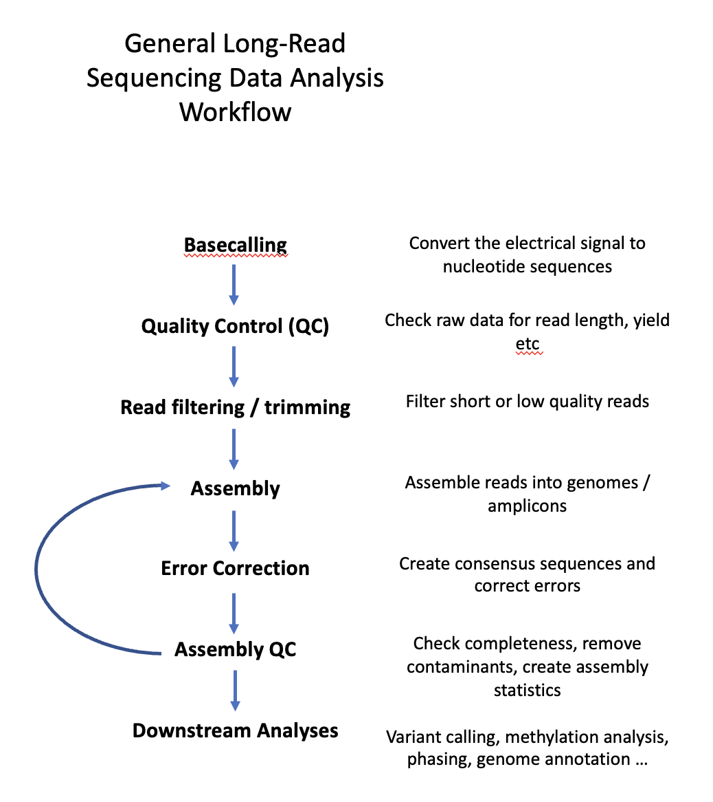

# Overview

11[](index.md) [](index.md) [](VM.md)

This course is intended to give an overview and good working knowledge for anyone who wants to get into bioinformatics for long-read sequencing data analysis. As an introduction it won't cover advanced tool use or workflows but it will introduce the main steps and standard tools used for long-read data analysis and raise awareness for potential problems and pitfalls.

# Course structure

The course is structured into different practicals which contain tasks, explanations and self-check questions. Answers can be reached via links below the questions. Important concepts, file formats and "pitfalls" will also be highlighted during the practicals.

For novice users the course begins with a command-line tutorial.

# Course environment

Bioinformatics is mostly done using a *command-line interface* on linux-based systems, e.g., Ubuntu Linux and MACOS. Windows users have several possibilities to set-up a linux-like system, eg., the *Windows Sub-system for Linux* which can be installed on Win10 and newer. However, this course uses a *virtual machine* with Ubuntu installed to provide a standardised linux system for all users. 

Course data, directories and conda installation files can be downloaded from a *Blue Mountains Analytics* Google Drive [here](https://drive.google.com/drive/folders/1qvpQ2fwCogx39klaP22JcVYVEwXxf50g?usp=share_link). How to set up the environment will be described on [How to set up the course environment](ENV_1.md) 

## VirtualBox (Windows)

To use the virtual machine image you will have to install [VirtualBox](https://virtualbox.org), which requires administrator rights. For installation instructions please see the [VirtualBox Installation](VM.md) page.

**Note:** As of 28/11/2022 the new VirtualBox v7 seems to create problems for some users. Please install **VirtualBox v6.1** from the wen-page instead.

## Non-VirtualBox (Linux / MACOS - Intel CPUs)

Linux users and MACOS users (Intel based processors) can choose to use their pre-installed *terminal* apps instead of VirtuaBox. How to set up the environment will be described on [How to set up the course environment](ENV_1.md) for how to set up the course environment on your local machine.

## MACOS users (M1/M2/ARM)

As of 28/22/2022 new Mac computers with the M1/M2 chips are not supported for this tutorial. The main reason being not all of the bioinformatics tools used in the tutorial are yet available for these architectures on package manager Conda (Mamba). Instead they have to either be manually compiled or not yet supported at all. We hope this will change in the future.

# Tools, dependencies and course data

A complete list of the tools, dependencies, and links to the data and conda environment files can be found [here](DATA.md#List-of-bioinformatic-tools-used)

<a href="https://bluemountainsanalytics.github.io/bma_ont_biosec_2022/VM.html">CONTINUE -></a>

