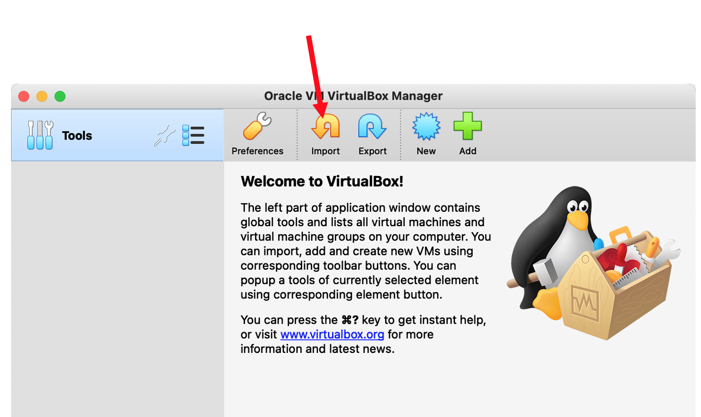
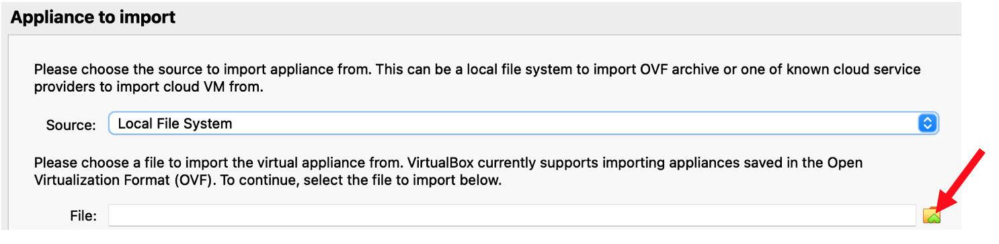
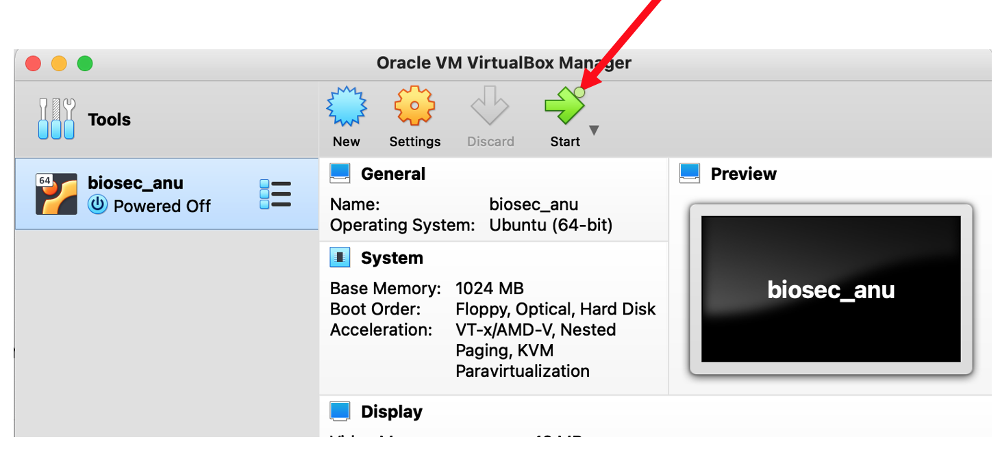

# How to set up the course environment 

[](VM.md) [](index.md) [](INTRO_1.md)

# VirtualBox users

## System requirements

To use the VIrtualBox image you need 

 * 64GB free space
 * 4GB RAM (16GB recommended, see below)
 * Quadcore CPU

## Download and import the VirtualBox course image

A *VirtualBox* image of the course including all data and tools needed can be downloaded from a *Blue Mountains Analytics* Google Drive [here](https://drive.google.com/drive/folders/1qvpQ2fwCogx39klaP22JcVYVEwXxf50g?usp=share_link). Download the file *biosec_anu.avo* and save it to your computer.

**Note** The VirtualBox image is around *15GB* in size, hence a good internet connection is required and it might take some time to download it.

Open the VirtualBox app (**not** the image you just downloaded but the VirtualBox v6.1 you installed on your computer).

Click on *Import Appliance* in the middle of the screen

In the new window, click on the little folder in the *file* section and in the pop-up file browser navigate to the biosec_anu.ova file you just downloaded.

Click *Continue* and on the next window *Import* to finish the import process.

You should now see the new *biosec_anu* appliance in the menu on the left. Select it (one click on the name) and start it by clicking the big green *Start* button on the top.

If everything works well you can delete the *biosec_anu.avo* file from your computer. It is not needed anymore and is only taking up lots of space.

## Non-VirtualBox users

TO set up the course environment on your local machine without VirtualBox, e.g., on Ubuntu and MACOS (Intel), please download the *biosec_course.tar.gz* file from the *Blue Mountains Analytics* Google Drive [here](https://drive.google.com/drive/folders/1qvpQ2fwCogx39klaP22JcVYVEwXxf50g?usp=share_link).

**Note** The course uses Conda environments as well as python v3 to install all tools needed. Please see [Miniconda installation](DATA.md#miniconda-installation) for COnda installation instructions.

After the download is finished please unpack the tar file **in your home directory** using

    course_user> tar -xzvf biosec_course.tar.gz

**Note** If the course data is extracted into another directory please adjust all paths in the install files accordingly.

Once that is done change into the directory */biosec_course/misc/install_files* and execute the following commands

    course_user> conda env create -f environment.yaml
    course_user> conda env create -f environment.artic.yaml
    course_user> conda env create -f environment.pangolin.yaml
    course_user> conda env create -f environment.busco.yaml
    course_user> install.sh
    course_user> basta.sh

**NOTE** Course material for the *artic* and *pangolin* analyses are not provided on these pages. For information please see the Sars Artic page [here](https://artic.network/ncov-2019).

Your environment should be ready to go.

<a href="https://bluemountainsanalytics.github.io/bma_ont_biosec_2022/INTRO_1.html">CONTINUE -></a>

