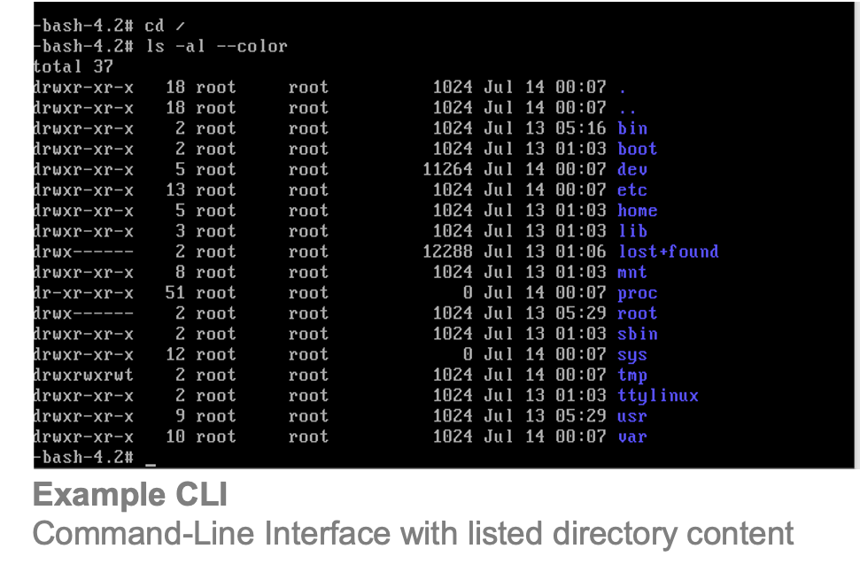
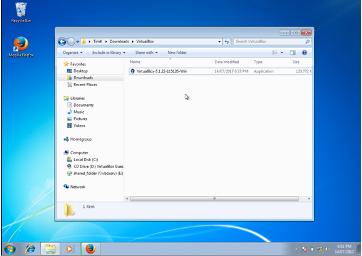

# Introduction

## Graphical vs Command-Line Interface

The command line interface (CLI) often simply referred to as the command-line, console or terminal,  is  a  way of  interacting  with  a  computer  by  means  of  typing  commands  on a specific line and submitting them to the computer by hitting the enter key.  Historically, the command-line was the initial way of interacting with a personal computer: a user typed commands using the keyboard and the computer executed them.

In contrast to the command line interface we interact with modern computers through graphical user interfaces (GUIs): on start-up we are greeted with logos of the computer vendor, colourful backgrounds and icons for the different programs, files and folders which we can click using a mouse-pointer or touch screen. The development a GUI and itsgraphical representation of the computer's storage content, clickable icons and a connected mouse-pointer, were crucial for the success of the personal computer.  

## Command-line and Bioinformatics

Many tools and programs in bioinformatics are command-line based programs that either don’t need or simply don’t have a GUI. In fact for a lot of bioinformatic application cases a GUI is more of a detriment than a benefit. Many bioinformatics tools are written by researchers from a wide range of scientific fields and not by professional software engineers. In a fast moving field such as bioinformatics with its frequently changing file formats and short half-life of existing tools a GUI adds another layer of complexity to a software project that has to be kept up-to-date. Therefore, and due to the fact that lightweight command-line based tools can easily be written, shared, and adapted to new tasks the vast majority of bioinformatics tools are command-line based and new developments in the field are almost exclusively provided in form of scripts and packages written in languages such as python, R, and perl.
