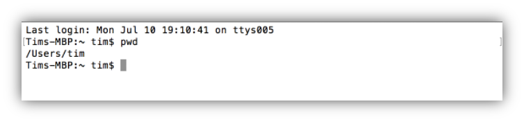
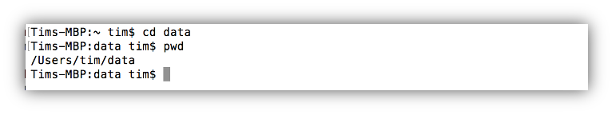
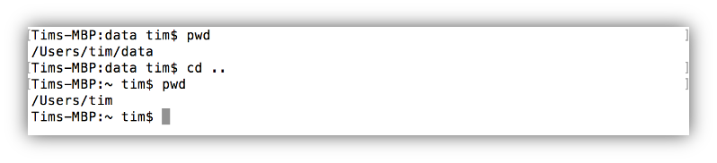

# Command-line Navigation

[](INTRO_1.md) [](index.md) [](INTRO_3.md)

## Location, location, location

When first working with a command line it is useful to keep in mind that a command line and a GUI have the same purpose: show and interact with the different programs, files and directories on a computer. The difference is simply how they do it. For example, when you log in on a Windows computer you see the Desktop and all the folders and files that are on it. In contrast, when you start a command line you see a more or less empty window. To get the current location, i.e., the directory you are in, one has to type specific commands on the command line.

Let’s start with the location. To see in which directory we are at the moment we can type the command **pwd** (short for print working directory) which prints out the current location:

 
As you can see in the example above the so called path to the current working directory is */Users/tim*. The *‘/’* symbol in a path denote a directories: thus */Users/tim* indicates that we are in directory */tim* which is a subdirectory of directory */Users*.

  
  Your *home* directory

  The default directory a user starts in after the login is also called the home directory of that user. It is usually named after the user (hence the */tim* directory).  On Apple systems all home directories are found in the */Users* directory. On Unix-based systems such as Ubuntu the home directories are usually located in  */homes*.

When we found out where we are we want to know how to change into another directory. For example, let’s say we know that there is a directory data in our home directory. To change into the data directory we use the command cd (short for change directory) followed by the location of the directory we want to change into. 

When we use the **pwd** command to check that we actually changed into the */data* directory the output shows */Users/tim/data* as our new location. This is the absolute path of the directory data. In contrast we only used the relative path for the cd  command. Relative paths are given relative to the current working directory, i.e., the directory you are currently in. Additionally, relative paths do NOT start with a *“/”* but either without a slash or using the notation *“./”* which means “this directory”.

In contrast to relative paths absolute paths specify a directory regardless of the current working directory. This means that we can change into the data directory from anywhere by using its absolute path. Absolute paths ALWAYS start with a *“/”* as they denote the the path from the lowest directory, i.e. root  directory, down to the specified location:

 
	
The last command for navigation on the command line is used to go one directory up into the parent directory of our current location. On the command line the parent directory of any location is specified by  two dots. This means if we are still in */Users/tim/data*  and want to change into the parent directory */Users/tim* we can do so by typing **cd ..**

  
  Self-Check 1
  <ol>
    <li>What does CLI stand for?</li>
    <li>What command tells you your current location on the CLI?</li>
    <li>With what command do you change into another directory?</li>
    <li>Can you think of way to change into the parent directory  other than using the command ‘cd ..’?</li>
  </ol>

[Answers](INTRO_ANS.md#selfcheck1)

[GO TO NEXT](INTRO_2.md)
