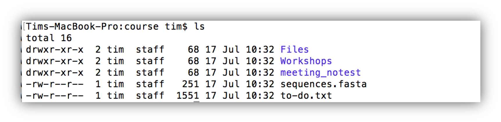
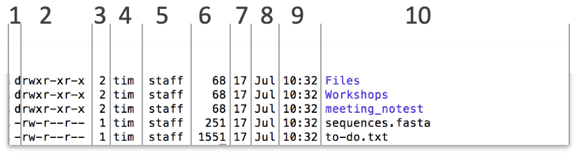

# Command Line - Files and Directories

[](INTRO_2.md) [](index.md) [](INTRO_4.md)

## Where are my files?

Now that we are able to navigate on the command line the next question is: how do I find out what files are in my directory? 
To view the content of a directory use the command **ll** (short for long list, i.e., a long version of the default command **ls** = list) which shows one line per file, program or directory in the specified location:

Wow, ok, we can see that there are a lot of things in there. Let’s  take a closer look: first of all we see that the output of **ll** consists of ten columns:

  
  **Explanation of *ll* output**
  <ol>
    <li>Type, d = directory, - = file</li>
    <li>Access rights,ie., who is allowed to read (r), write (w) or execute the file/directory.</li>
    <li>Link Count</li>
    <li>Owner of the file/directory</li>
    <li>Group the file/directory belongs to</li>
    <li>Size in bytes</li>
    <li>Day it was created/last modified</li>
    <li>Month it was created/last modified</li>
    <li>Time (if this year) or year it was created/last modified</li>
    <li>Name of the file/directory</li>
  </ol>

For beginners, the columns of most importance are usually

  <ul>
    <li>1 - Is it a file or a directory?<li>
    <li>4 - Who does the file belong to?</li>
    <li>6 - How big is a file?</li>
    <li>10 - What is the name of the file/directory?</li>
  </ul>

Many CLIs also distinguish the type of a directory item by colour: directories are shown in blue, files in black.

With this knowledge we can now properly interpret the output of ll of our current working directory:

  <ul>
    <li>It contains 3 directories: *Files*, *Workshops* and *meeting_notest*</li>
    <li>It contains 2 files: *sequence.fasta* and *to-do.txt*</li>
    <li>All files were created by me  (user *tim*)</li>
    <li>The file *sequences.fasta*  is 251 bytes and file *to-do.txt* is of size 1551 bytes</li>
  </ul>

[](QC.md) [](index.md) [](QC_M.md)
