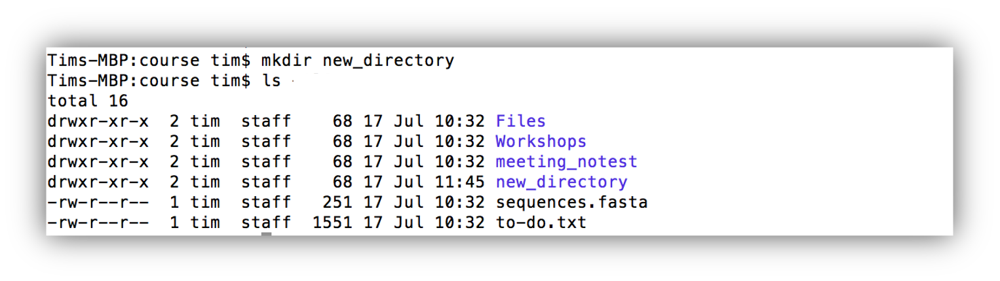
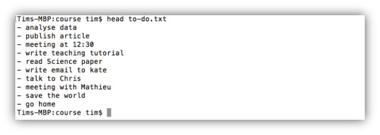
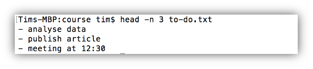

# Command Line - Commands 

[](INTRO_3.md) [](index.md) [](CTOOLS.md)

## Commands, arguments, and flags

We have already used several different command line commands, e.g. **pwd** and **cd**. The difference between these two commands is that **pwd** can be run by itself whereas **cd** expects an additional argument: the name of the directory which we want to change into. Many different command line commands expect arguments, e.g. the command **mkdir** (short for make directory) can be used to create a new directory. It expects the *name of the new directory* as an argument:

As you can see in the output of **ll** there is now a new directory called *new_directory*. Similarly, we can remove a directory with the command **rmdir** (short for remove directory) and give *the name of the directory to remove* as an argument:

  
  <b>Command <i>rmdir</i></b>

  The command **rmdir** only removes *empy* directories! To remove directories that are not empty one would have to first delete all the files in the directory or use the command **rm** (see below for more on this command(

Besides arguments the behavior of many commands can be altered by calling them with specific options, also called *flags*. In contrast to arguments, flags start with one or sometimes two hyphens. For example, to remove a file we can use the command **rm**, which expects as argument the relative or absolute path to the file that should be removed. To remove the file *sequences.fasta* in our directory we can type

    tim$ rm sequences.fasta

However, if we try to remove a directory using this command we will get a notice that *Files is a directory*: 

    tim$ rm Files
    rm: Files/: is a directory

To remove a directory using the **rm** command we have to add the flag **-r**, which stands for *recursive*. This will first remove all the contens of the directoy *recursively*, i.e., one after the other, and then delete the directory itself:

    tim$ rm -r Files

  
  <b>Use rm with care!</b>

  In contrast to the *Move to Recycle Bin* option that can be found on Windows, OSX, or the GUI of linux operating systems like Ubuntu, the command-line does not have a Recycle Bin.

  <b>Files and directories removed with *rm* are gone and can't be recovered!!</b>

The **-r** flag of **rm** is used without any arguments, it acts like a switch for the behavior of **rm**. However, some flags also expect arguments. 
Lets have a look at the command **head**. This command can be used to show the first lines of a text file. It expects the path to the file of interest as the argument and if no options are specified, it prints the first 10 lines of the specified file to the command line. Let’s have a look at the first 10 lines of the file *to-do.txt* in our current working directory using **head**:

As you can see I still have quite a few things to do before I can go home. However, if we want to list a specified number of lines using head we can do so by using the *–n* flag of **head** and pass the number of lines we want to be listed as a parameter:

Thus, a CLI command consists of

<ul>
  <li>the command itself</li>
  <li>zero, one or more flags (optional)</li>
  <li>flag arguments (where applicable)</li>
  <li>arguments (where applicable)</li>
</ul>

  
  <b>Self-Check 2</b>

  <ol>
    <li>?How do you list the content of your current directory</li>
    <li>Which column of the ls output shows the size of a file?</li>
    <li>How do you create a directory?</li>
    <li>How do you add an option to a command?</li>
    <li>How do you list the first 5 lines of a file?</li>
  </ol>

[Answers](INTRO_ANS.md#selfcheck2) 

<a href="https://bluemountainsanalytics.github.io/BMA_CLI-tutorial/CTOOLS.html">CONTINUE -></a>

