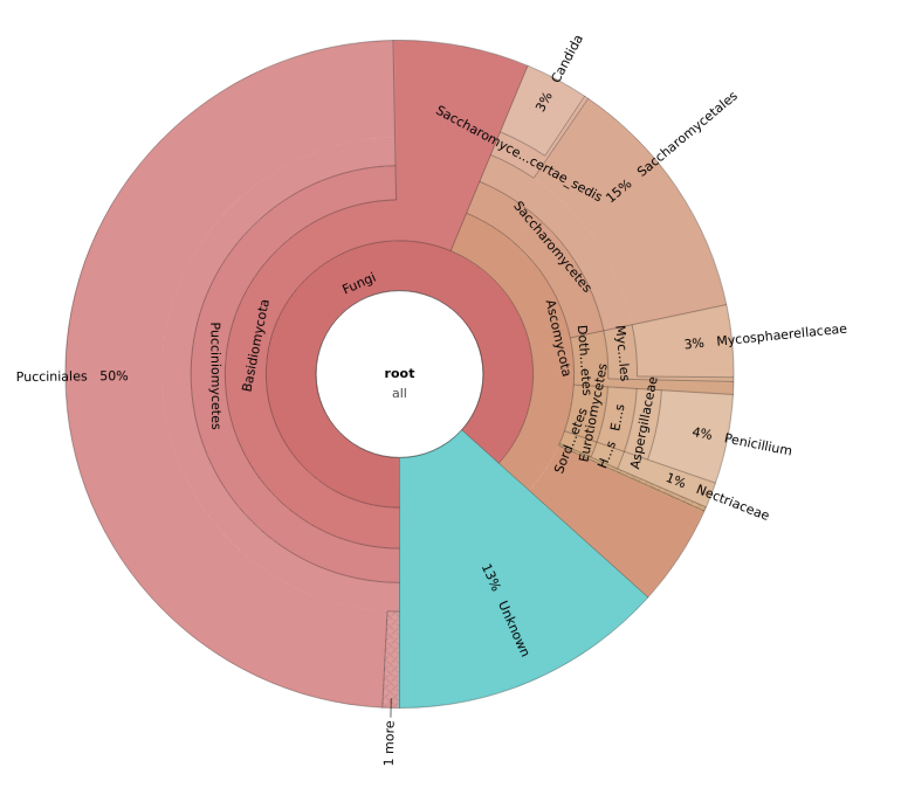
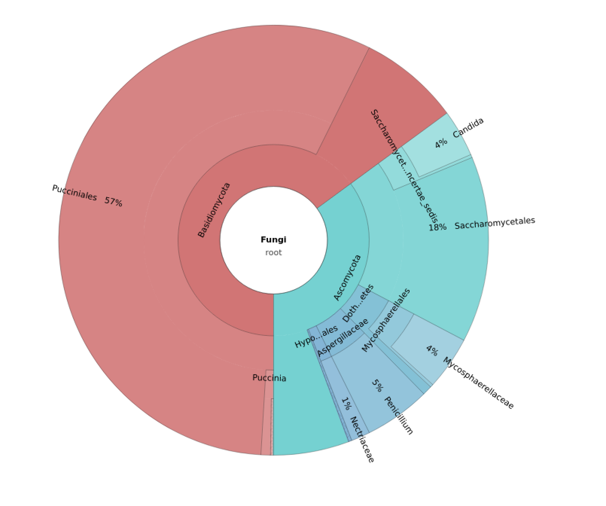
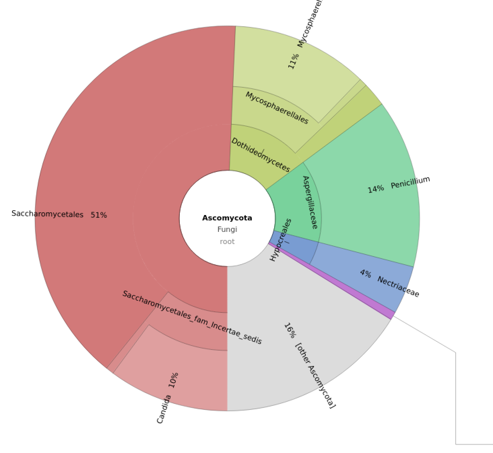

# Answers to ITS analysis

1. What are the main groups and their ratios?

From the graphs it seems the main groups are

  * 13% Unknown 
  * 87% fungi

Of the fungi 

  * 65% of fungi are Basidiomycota
  * 35% of fungi are Ascomycota

with Ascomycota being the most diverse group.

<a href="https://bluemountainsanalytics.github.io/bma_ont_biosec_2022/ITS.html">BACK =></a>

