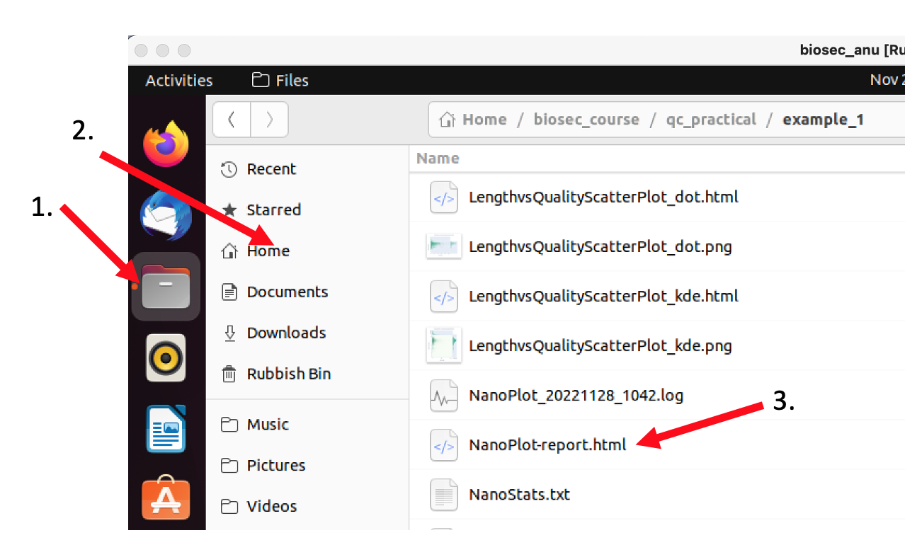

# Quality Control using the NanoPlot

[](QC.md) [](index.md) [](QC_F.md)

NanoPlot gives a good overall overview over a single sequencing run. It can use several file formats as input, e.g., the sequencing_summary file created by the basecaller, and fastq files containing the basecalled read sequences.

Given an input file and a location where to store the output files NanoPlot will create several files in *html* format which any browser can open as a web-page.

Change into the *qc_practicals* directory and create a directory for the nanoplot output, e.g. *example_1*:

    course_user> cd ~/biosec_course/qc_practical
    course_user> mkdir example_1

In the *qc_practical* directory you will also see *summary_files* directory with an example summary file in it.  Change into the directory and use the command **head** to show the content of the summary file.

    course_user> cd ./summary_files
    course_user> head ./sequencing_summary.txt

As you can see the sequencing_summary file is a tab-separated file with one read/sequence per line and a number of statistics of each read.

Now, use Nanoplot to create a summary of all the sequences in this run. First, change back into the *~/biosec_course/qc_practical directory*. Then call NanoPlot, specify that it is a summary file you want to use as input using the flag *--summary*, and give the *example_1* directory as the output directory with the *-o* flag:

    course_user> NanoPlot --summary ./summary_files/sequencing_summary.txt -o ./example_1

  
  Do <b>not</b> copy-paste the commands shown on the tutorial pages! Some characters, e.g., the hyphens, change based on the font used causing random errors in the commands! Even if it seems silly, please type the commands yourself.

Once NanoPlot is done change into the *example_1* directory and have a look at the different files NanoPlot created using the **ll** command. The main file showing all the different statistics on one page is called *NanoPlot-report.html*. This file can be opened in your browser, e.g., via the *Open File* menu button in FireFox.

The output of NanoPlot is structured in two main parts: a tabular header with summary statistics about the sequencing run, and a number of plots giving more detail about certain statistics. 

If you're nto familiar with the *N50* and *Quality score* statistics, have a look at the rest of the page before you try to answer the questions. 

  
  <ol>
    <li>How many reads did the sequencing run yield? How many nucleotides in total?</li>
    <li>What is the median and mean read length? What the read quality?</li>
    <li>What is the N50 of the sequencing run?</li>
    <li>How many reads have less than 10% error probability?</li>
    <li>What is the longest read in the sequencing run and what is its quality score?</li>
    <li>Have a look at the “Read length vs Average read quality”. Is there a link between read length and PHRED score?</li>
    <li>Have a look at the *Yield over time* and *Numebr of reads over time* plots. What do you think happened ~5h into the sequencing run?</li>
    <li>What can you say with regards to yield and quality over time? Was this a good sequencing run?</li>
  </ol>

[Answers](QC_ANS.md)

# Sequencing run Summary Statistics

## Q-score and sequencing quality

The Q-score is a measure of the quality (correctness) of a sequencer’s base calling. It represents the logarithmic probability of a basecalling error at a position of the read. In nanopore data the phred score is given as the integer value for the error probability P and can be calculated through

For example, a Q-score of 10 of a nucleotide means there is a 10% chance that this nucleotide is not correct/a sequencing error. 

## N-50 metric

The N metrics are a measure of contiguity of a set of sequences historically used to assess genome assemblies.

The N50 is related to the median and mean length of a set of sequences. Its value represents the length of the shortest read in the group of longest sequences that together represent (at least) 50% of the nucleotides in the set of sequences.

Example:
Six reads of length 10, 11, 12, 13, 14, 15, 16.
The combined length is 81 nucleotides and 50% = 40.5 nucleotides.

To get the N50 value start at the longest read and add the length of the next shorter one until you reach (at least) 50% of the total number of nucleotides:

                16 + 15 + 14 = 45

The N50 value of this set of sequences is 14.

The N50 value can be seen as a weighted midpoint of the read length distribution of a sequencing run. However, the N50 value has to be interpreted in context of the total number of reads in a sequencing run. For example, a large number of very short reads may not have a big impact on the N50 value of a sequencing run but would arguably be worse than a sequencing run with less reads and similar N50 value.

Another common metric is the N90 value, representing the shortest read in the group of longest reads that together represent 90% of all the nucleotides.

In the example above the N90 value is 10.

  
  N50-values alone can be mis-leading are on its own is not a useful measure to assess the quality of an assembly. For example, the assmblies with the following contig lengths have the same N50 although one is more contiguous than the other: 
  <ul>
    <li>3, 3, 3, 3, 3, 3, 3, 3, 3, 3, 25, 25, 150, 1500</li>
    <li>50, 500, 530, 650</li>
  </ul>
  As shown above, many short reads in an assembly may not affect the N50 which is one of the reasons why the N50 (alone) is not a useful metric to assess or compare assembly qualities.

<a href="https://bluemountainsanalytics.github.io/bma_ont_biosec_2022/QC_F.html">CONTINUE -></a>

