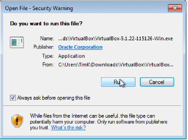
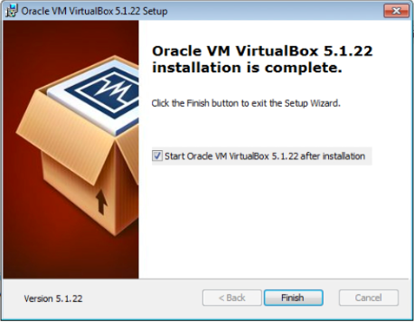
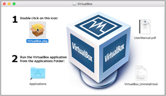
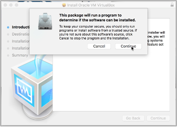
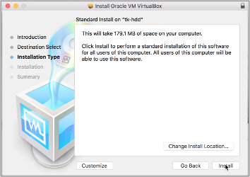

# VirtualBox

[](ENV.md) [](index.md) [](ENV_1.md)

VirtualBox is a free software tool that lets you load so called virtual machines on your computer. A virtual machine like a small pre-configured operating system that you can simply run in a window on your desktop computer or laptop. For example, if you have windows installed on your computer and a virtual machine with linux installed on it you can run this linux on your windows computer in a window just like your internet browser or any other app.

## Download VirtualBox

VirtualBox can be downloaded from the official [homepage](http://www.virtualbox.org). Click on *Downloads* on the left menu to download Virtualbox.

**Note** As of 28/11/2022 we advice to download [VirtualBox 6.1 builds](https://www.virtualbox.org/wiki/Download_Old_Builds_6_1). The recently published VirtualBox v7 seems to not install protperly for some users.

For Windows users click on *Windows hosts*. 

For older / non-M1 MacBooks or other Apple computers select *macOS/Intel hosts*. 

**New M1/M2 Macs are not supported!!** The *Developer preview for macOS / Arm64 (M1/M2) hosts* is **NOT** a working VirtualBox version and will not install on your systems.

Save the installer in a location of your choice.

### Install on Windows computers

After the download is finished go to the location where you saved the file, double click the installer and run the installation process.

Follow the installation wizard and leave all the different default settings as they are, i.e., click next, accept, yes or finish. 

Congratulations, you just installed VirtualBox. To start the software double click the icon on your desktop.

### Install VirtualBox on MAC computers

After the download is finished go to the location where you saved the dmg file and double click it.  In the pop-up window couble click the yellow VirtualBox.pkg icon.

After clicking the installation process will start and several dialog windows will appear. 

Follow the instructions and continue the installation process until it is finished. You might have to type in your administrator password at one point to finish the installation. 

Congratulations, you just installed VirtualBox. To start the software double click the VirtualBox.app in your Applications folder.

<a href="https://bluemountainsanalytics.github.io/bma_ont_biosec_2022/ENV_1.html">CONTINUE -></a>

